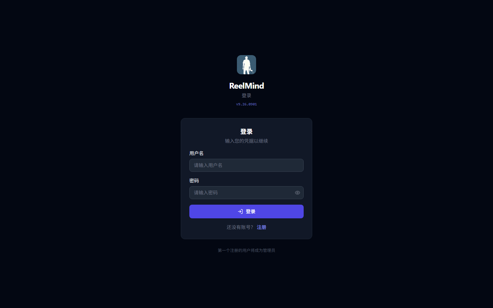
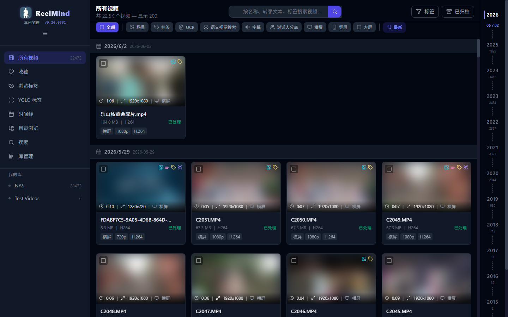
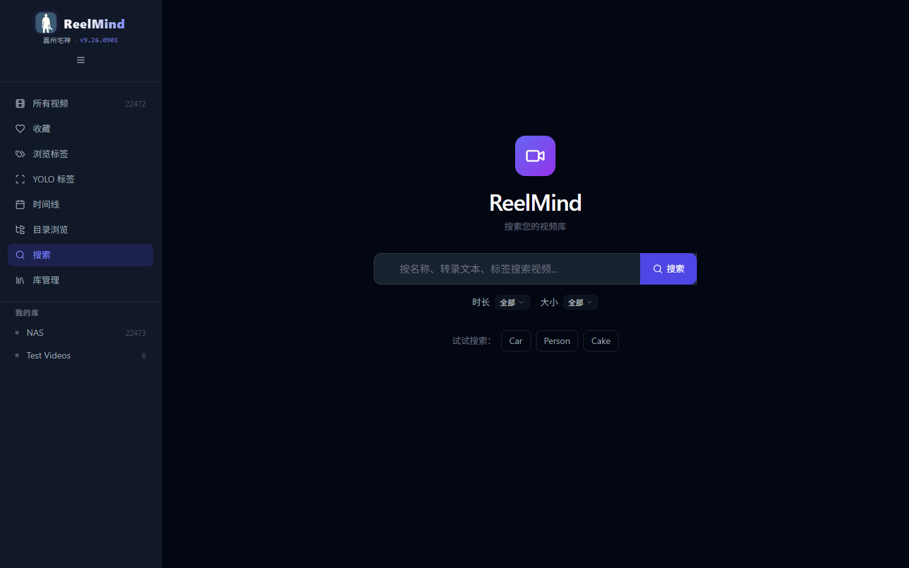
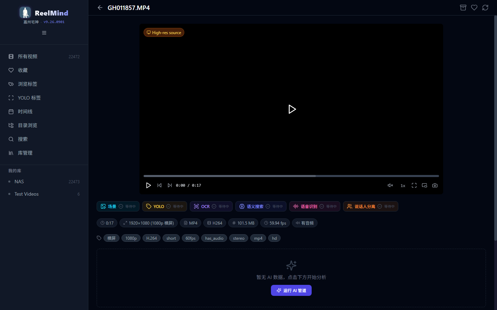
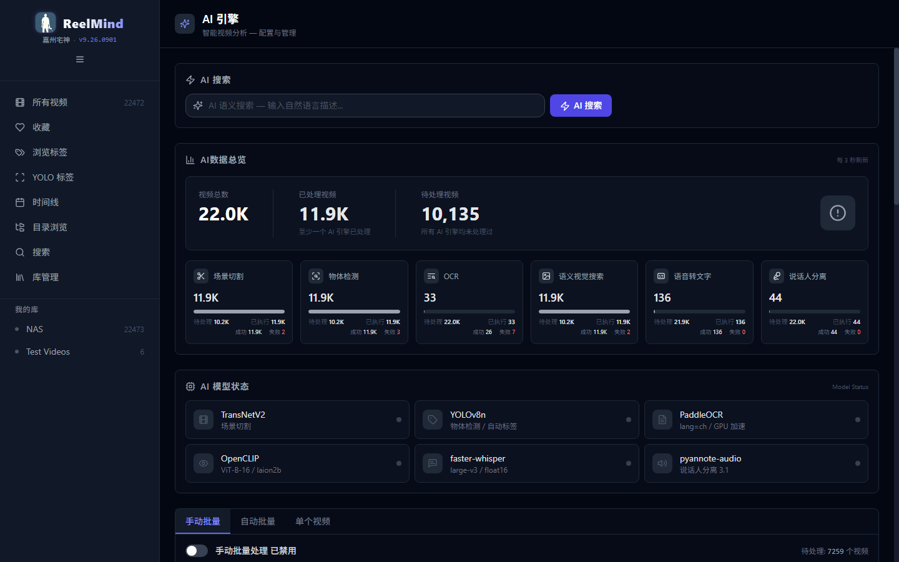

# ReelMind — AI-Powered Self-Hosted Video Library

[](https://github.com/JiaZhouZhaiShen/reelmind/actions/workflows/ci.yml)

> A self-hosted video library manager for editors, teams, and AI agents. Inspired by IMMICH, **specialized for video**.

ReelMind manages thousands of video assets, auto-extracts scenes / subtitles / object tags / OCR / CLIP embeddings, and provides full-text + semantic hybrid search — with AI inference fully decoupled from the web API via a separate GPU container.

## Architecture (Docker Compose, 6 containers)

| Container | Port | GPU | Role |
|-----------|------|-----|------|
| `reelmind-server` | internal | — | FastAPI gateway, AI proxy, file scan, web backend |
| `reelmind-ai` | 2589 | ✅ | AI pipeline orchestration (5 models) |
| `reelmind-orchestrator` | — | — | Lightweight job scheduler |
| `reelmind-postgres` | — | — | Asset metadata + pgvector |
| `reelmind-redis` | — | — | Cache + progress pub-sub |
| `reelmind-nginx` | **2588** | — | Reverse proxy, zero-copy video streaming, static assets |

**AI pipeline (sequential):** TransNetV2 (scene cut) → YOLOv8n (objects) → PaddleOCR (text) → OpenCLIP (semantic vectors) → faster-whisper (transcript) (+ optional pyannote diarization).

## Screenshots

> Captured from a real local ReelMind instance. Thumbnails are blurred to protect private video content.

| Login page | Video library grid |
|---|---|
|  |  |

| Search results | Video player | AI engine |
|---|---|---|
|  |  |  |

## Deploy from GitHub Container Registry (ghcr)

Prebuilt images are published to GHCR, so you can skip `docker compose build`:

```bash
git clone https://github.com/JiaZhouZhaiShen/reelmind.git
cd reelmind

# 1. Configure environment (template is committed; placeholder only, no secrets)
cp .env.example .env

# 2. Build the frontend once (v1: web/dist is mounted read-only, not baked into images yet)
cd web && npm install && npm run build && cd ..

# 3. Point compose at GHCR images (the version tag matches a git release)
export REELMIND_SERVER_IMAGE=ghcr.io/jiazhouzhaishen/reelmind-server:v9.26.0901
export REELMIND_ORCHESTRATOR_IMAGE=ghcr.io/jiazhouzhaishen/reelmind-orchestrator:v9.26.0901
export REELMIND_AI_IMAGE=ghcr.io/jiazhouzhaishen/reelmind-ai:v9.26.0901
export REELMIND_NGINX_IMAGE=ghcr.io/jiazhouzhaishen/reelmind-nginx:v9.26.0901

# 4. Pull and start (no local image build)
docker compose pull
docker compose up -d
```

Without those variables the default stays unchanged: `docker compose build && docker compose up -d` builds locally.

## Quick Start

```bash
git clone https://github.com/JiaZhouZhaiShen/reelmind.git
cd reelmind

# 1. Configure environment (template is committed; placeholder only, no secrets)
cp .env.example .env
#    🔴 Edit .env: set strong DB_PASSWORD and JWT_SECRET (openssl rand -hex 32)

# 2. Build frontend (web/dist is mounted read-only into containers)
cd web && npm install && npm run build && cd ..

# 3. Build images locally and start (registry alternative: see "Deploy from ghcr" above)
docker compose build
docker compose up -d

# 4. Verify
curl http://localhost:2588/api/ping
curl http://localhost:2589/health
# Open http://localhost:2588
```

**First user = admin:** the very first registered account gets the `admin` role automatically.

> GPU note: `reelmind-ai` uses `runtime: nvidia` (CUDA 12.4). Without a GPU, disable AI (`ENABLE_WHISPER=false`, `ENABLE_CLIP=false`) or remove the runtime line — the app still works as a video manager / search tool.
> First AI run downloads models automatically into the data volume (whisper large-v3 ≈ 3GB+).

## Features

- **Video library management** — multi-library, NAS/external mounts, bulk scan & metadata extraction (ffprobe)
- **Search** — full-text, smart (metadata+tags+transcript), tag system, CLIP semantic similarity
- **Preview** — thumbnail grid, H.264 proxy streams, scene browser, web player with transcript overlay
- **AI (optional)** — scene detection, object tags, OCR, speech-to-text, speaker diarization
- **API** — full REST JSON API; health endpoints for external tooling / AI agents

## Configuration highlights

| Variable | Default | Notes |
|----------|---------|-------|
| `DB_PASSWORD` / `JWT_SECRET` | `change-me` | 🔴 must be replaced in production |
| `EXTERNAL_MEDIA_DIR` | `./media` | media library root (mount a NAS/share here) |
| `PORT_MAP` | `0.0.0.0:2588` | external port |
| `ENABLE_WHISPER` / `WHISPER_MODEL` | `true` / `large-v3` | use `tiny` on low-memory devices |
| `ENABLE_CLIP` | `true` | semantic search (~2GB extra RAM) |

Full list: see `.env.example` comments.

## Documentation

| Doc | Purpose |
|-----|---------|
| `docs/必读_项目介绍与部署指南.md` | Project intro + deployment guide (Chinese) |
| `docs/en/PROJECT_GUIDE.md` | Deployment guide (English mirror) |
| `docs/铁律.md` / `docs/en/IRON_RULES.md` | Development iron rules (34 rules, R0-R7) |
| `docs/规范/` / `docs/en/STANDARDS/` | Per-layer standards (ZH authoritative, EN mirror) |

## Development

```bash
# Backend (live reload via bind mount — restart container, no rebuild)
docker compose restart reelmind-server reelmind-ai reelmind-orchestrator

# Frontend hot reload
cd web && npm run dev   # http://localhost:5173 (proxies /api to :2588)

# Quality gates
./scripts/check.sh              # 13 iron-rule checks (also run by pre-commit)
cd web && npm run typecheck     # tsc --noEmit
```

## License

MIT © 2024 JiaZhouZhaiShen
